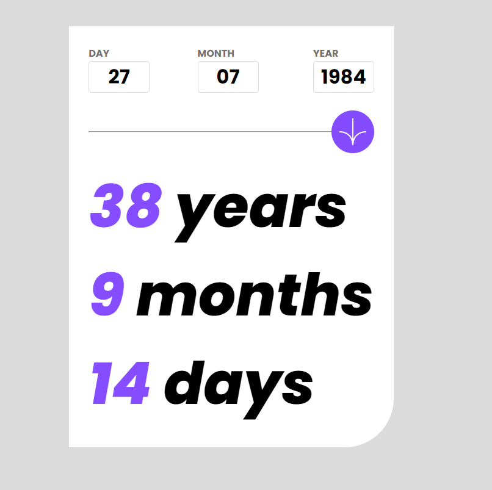

# Frontend Mentor - Age calculator app solution

This is a solution to the [Age calculator app challenge on Frontend Mentor](https://www.frontendmentor.io/challenges/age-calculator-app-dF9DFFpj-Q). Frontend Mentor challenges help you improve your coding skills by building realistic projects. 

## Table of contents

- [Overview](#overview)
  - [The challenge](#the-challenge)
  - [Screenshot](#screenshot)
  - [Links](#links)
- [My process](#my-process)
  - [Built with](#built-with)
  - [Code explanation](#code-explanation)
  - [Continued development](#continued-development)
  - [Useful resources](#useful-resources)
- [Author](#author)


## Overview

### The challenge

Users should be able to:

- View an age in years, months, and days after submitting a valid date through the form
- Receive validation errors if:
  - Any field is empty when the form is submitted
  - The day number is not between 1-31
  - The month number is not between 1-12
  - The year is in the future
- View the optimal layout for the interface depending on their device's screen size
- See hover and focus states for all interactive elements on the page

### Screenshot



### Links

- Solution URL: [Add solution URL here](https://your-solution-url.com)
- Live Site URL: [Add live site URL here](https://your-live-site-url.com)

## My process

### Built with

- Semantic HTML5 markup
- Sass
- Flexbox
- Mobile-first workflow
- [React](https://reactjs.org/) - JS library

### Code explanation

Use this section to recap over some of your major learnings while working through this project. Writing these out and providing code samples of areas you want to highlight is a great way to reinforce your own knowledge.

To see how you can add code snippets, see below:

```js
const getAge = ()=>{
    const today = new Date()
    const userDate = new Date(`${year}-${month}-${day}`)
    const timeDifference = today - userDate
    const millisecondsPerDay = 24 * 60 * 60 * 1000
    setAgeYear(Math.floor(timeDifference / (365 * millisecondsPerDay)))
    setAgeMonth(Math.floor((timeDifference % (365 * millisecondsPerDay)) / (30 * millisecondsPerDay)))
    setAgeDays(Math.floor((timeDifference % (30 * millisecondsPerDay)) / millisecondsPerDay))

  }
}
```

Let's go through the code step by step:

const today = new Date(): This creates a new Date object representing the current date and time.

const userDate = new Date(${year}-${month}-${day}): This creates a new Date object representing the user's birthdate, which is passed as parameters year, month, and day to the function. The birthdate is constructed by concatenating the year, month, and day values using template literals.

const timeDifference = today - userDate: This calculates the time difference between the current date (today) and the user's birthdate (userDate) in milliseconds.

const millisecondsPerDay = 24 * 60 * 60 * 1000: This calculates the number of milliseconds in one day, by multiplying the number of hours (24), minutes (60), seconds (60), and milliseconds (1000) in a day.

setAgeYear(Math.floor(timeDifference / (365 * millisecondsPerDay))): This calculates the age in years by dividing the timeDifference by the total number of milliseconds in a year (365 * millisecondsPerDay), and then rounding down to the nearest integer using Math.floor(). The result is then passed to a function called setAgeYear() which presumably sets the calculated age in years somewhere in the code.

setAgeMonth(Math.floor((timeDifference % (365 * millisecondsPerDay)) / (30 * millisecondsPerDay))): This calculates the age in months by first finding the remainder of dividing timeDifference by the total number of milliseconds in a year (365 * millisecondsPerDay), and then dividing that remainder by the total number of milliseconds in a month (30 * millisecondsPerDay). The result is then rounded down to the nearest integer using Math.floor() and passed to a function called setAgeMonth() which presumably sets the calculated age in months somewhere in the code.

```js
 const getDate = (ref) =>{
    if (ref.current.name === "day"){
      if(ref.current.value < 0 || ref.current.value >=31){
        dayErrorRef.current.classList.remove('hidden')
        dayLabel.current.classList.add('error')
      }else{
        setDay(dayRef.current.value)
        dayErrorRef.current.classList.add('hidden')
        dayLabel.current.classList.remove('error')
      }
    }else if(ref.current.name === "month"){
      if(ref.current.value< 0 || ref.current.value >=12){
        monthErrorRef.current.classList.remove('hidden')
        monthLabel.current.classList.add('error')
      }else{
        setMonth(monthRef.current.value)
        monthErrorRef.current.classList.add('hidden')
        monthLabel.current.classList.remove('error')
      }
    }else if(ref.current.name === "year"){
      const year = new Date().getFullYear()
      if(ref.current.value > year){ 
        yearErrorRef.current.classList.remove('hidden')
        yearLabel.current.classList.add('error')
      }else{
        setYear(yearRef.current.value)
        yearErrorRef.current.classList.add('hidden')
        yearLabel.current.classList.remove('error')
      }
    }
  }
```
This function validates user input values. The day value must be between 1 and 31, the month must be between 1 and 12, and the year must be in the future compared to today's date. Appropriate error messages will be displayed below the input based on the specific case.

## Author

- Github - [Ricardo Halmoguera](https://github.com/RickHalmoguera)
- Frontend Mentor - [@RickHalmoguera](https://www.frontendmentor.io/profile/RickHalmoguera)


